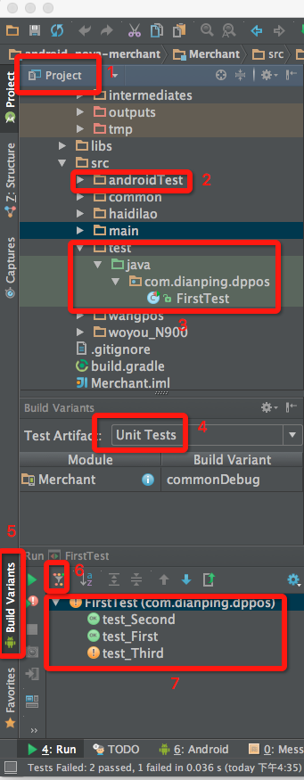
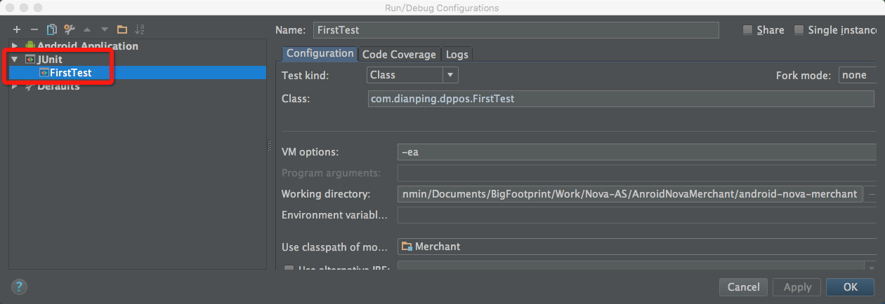
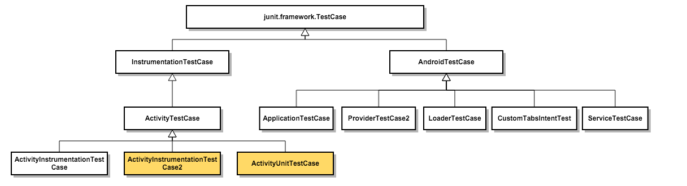

翻译总结一篇讲述Android单元测试的文章，比官网的讲述更具条理。同时描述一些在实践中遇到的坑。

__官网文档入口__  [Best Practices for Testing](http://developer.android.com/intl/zh-cn/training/testing.html)  
__英文原文地址__  [Developing Android unit and instrumentation tests](http://www.vogella.com/tutorials/AndroidTesting/article.html)

>【建议】读者最好先大致看一下官网文档，理清楚相关概念，然后再比对英文原文和本文的翻译，边阅读边实践。

## 为什么 Android 应用需要测试？
### 为什么测试 Android 应用尤其重要？
android应用在一种资源（内存，CPU，电量等）有限的情况下运行，并且运行情况依赖于外部因素，比如是否联网，使用情况等，因此测试优化 android 应用非常重要，对应用进行适当的测试有助于提高应用质量，增强可维护性。<!--more-->

### Android 测试策略
在所有不同配置的设备上测试一个应用是不大可能的，一般来说只能在典型的设备上进行测试——测试的时候应该选取一个尽可能低配置的设备和尽可能高配置的设备进行测试，所谓配置，是诸如屏幕分辨率，像素密度等。

### Android 的测试支持
2015 年用于 Android 应用的测试工具和框架得到了极大的提升。Android 的整个测试支持系统被更新到基于JUnit4，单元测试代码既可以运行在 JVM 上，也可以运行在 Android 设备上。同时，Google 引入了新的UI测试框架—— Espresso，使得测试 Android 应用的 UI 变得更加容易。

## 前置要求
下面的描述基于如下假设：

1. 读者已经知道如何创建一个 Android 应用，读者可以阅读[Android Tutorial](http://www.vogella.com/tutorials/Android/article.html)获取更详细的消息;
2. 读者了解 Android 的编译系统—— Gradle，读者可以阅读[Building Android applications with Gradle Tutorial](http://www.vogella.com/tutorials/AndroidBuild/article.html)进行基本了解;
3. 对 JUnit 测试框架有一定的了解，这个网上资料很多，推荐一篇[Java单元测试(Junit+Mock+代码覆盖率)](http://thihy.iteye.com/blog/1771826)

## Android自动化测试
### 测试什么？
一般来说，我们测试的重点是应用的业务逻辑，以下的测试比例是比较合理的：

1. 70%~80% 的单元测试用来保证底层代码的稳定性；
2. 20%~30% 的功能测试用来保证应用的确可以正常运行；
3. 少量的功能测试用于测试你的应用和别的应用的交互——如果有的话；

### 测试前置条件
在 Android 测试中为所有的测试声明一个 __testPreconditions()__ 方法是一个很好的做法，如果这个方法执行失败了，你可以立即知道其他测试所依赖的前置条件不满足（换言之：通过这个方法保证为后续的测试提供一个稳定的测试环境）。

### 测试单个 App 或者多个App
测试另外一个重要考量标准就是你是单独测试你自己的应用还是测试你的应用和别的应用的集成（即两者的交互）。如果你只是测试你自己的应用，那么你可以使用一些需要了解应用内部信息的测试框架（比如 viewId ）——这涉及到测试框架的选择。

## Android 普通单元和 Instrumentation 单元测试
### Android 单元测试种类
Android 单元测试是基于 JUnit 的，可以分为两类：

1. 本地单元测试——测试运行在 JVM 上；
2. Instrumentation 单元测试——测试需要运行在 Android 系统上；

测试的时候应该尽可能使用本地单元测试，因为本地单元测试相较而言更快，Instrumentation 单元测试需要部署应用并且在 Android 设备上运行测试。

### 本地单元测试
Android Gradle 支持在 JVM 上运行 Android 单元测试，为了实现这个目标，Gradle 创建了一个特殊版本的android.jar（也成为Android mockable jar）来提供单元测试需要的各种属性、方法、类。调用这个 jar 包中的任何函数都会导致异常。

因此，如果你的类没有调用任何的 Android API 或者只是有很简单的依赖，你可以毫无限制的使用 JUnit 测试框架（或者别的任何 Java 单元测试框架）。单元测试代码中任何对 Android 的依赖都应该被替换掉，可以使用诸如 Mockito 这样的 Mock 框架。

在 JVM 上运行测试 case 的好处就是速度——比起在 Android 机器上运行要快很多很多。

### 使用 Instrumented test 测试使用了 Android API 的类
如果你需要测试使用了 Android API 的代码，你需要在 Android 设备上运行测试代码（因为 Android 工具上 mock 出来的 android.jar 并不执行真正的 Android 代码，而只是简单的抛出异常），不幸的是，这使得测试的执行漫长了许多。

## Android 的项目结构和测试文件夹的创建
### Android 的测试项目结构
比较推荐的方式是按照约定组织 source 代码和测试代码（Gradle 有自己的约定），你的应用项目结构应该按照下面的文件夹结构进行组织:

* app/src/main/java - 放置项目的源码
* app/src/test/java - 放置运行在 JVM 上的单元测试代码
* app/src/androidTest/java - 放置需要运行在 Android 设备上的测试代码

如果你按照这个约定来，那么 Android 的编译系统（Gradle）会自动将对应的测试代码运行在 JVM 和 Android 设备上。

Gradle 上可以配置这几个文件夹，读者在不熟悉 Gradle 的情况下并且没有特殊需求的情况下，不建议修改这个约定。

## 编写本地单元测试并且运行
先上图，让读者有个大致的了解：



### 简介
在 Android 上我们使用术语__"单元测试"__来表示那些运行在本地 JVM 上的测试代码。单元测试应当被用来验证一个Activity 的状态以及它与其余组件的交互，前提是在独立的环境下（与系统其余部分没有联系），它一般用来测试代码的一小部分，比如一个方法，一个类或者一个组件，且不依赖系统或者网络资源等外部环境。举个栗子，假设在 Activity 上有一个 button 是用来启动另外一个 Activity 的，单元测试应该被用来测试启动 Activity 对应的 intent 是否正确，而不是那个 Activity 是否被启动。

如前面所述，单元测试的执行基于一个被修改的 android.jar 包，所有的 final 修饰符都被移除掉了，这使得使用mock 库成为现实——如果你需要依赖 Android 平台，你就使用 mock 的框架来代替那些调用。
>实践中发现这一点极大的限制了本地单测的应用。我们有一个业务使用了 SparseArray，导致逻辑完全不可侧，因为 Mock 出来的对象完全不具备 SparseArray 功能。

### 依赖
开发者官网上建议在 build.gradle 中添加如下依赖：

```xml
dependencies {
    // Unit testing dependencies
    testCompile 'junit:junit:4.12'
    // Set this dependency if you want to use Mockito
    testCompile 'org.mockito:mockito-core:1.10.19'
    // Set this dependency if you want to use Hamcrest matching
    testCompile 'org.hamcrest:hamcrest-library:1.1'
}
```
每个包的作用注释中都已经标出。注意：这里千万不要写成 compile，然后去 File——>Project Structure——>选中 Module——>Dependencies 里面，再将这三个库的 Scope 改为 Test Compile，实践中，这样操作这里会变成androidTestCompile。总之，请确保这里是 testCompile。

### 代码位置
我的 Android Studio 版本是 1.3.2，新建的 Android 项目下面自带 androidTest 目录，但是并没有 test 目录。按照前面所讲述的目录结构约定，我们将项目视图切换到 Project 下面，在 src 目录下面新建一个 test 目录。读者注意上图中的 1，2，3 三个部分，另外读者应该点击 5，调出 "Build Variants" 视图，然后将 Test Artifact 设置为 Unit Test。

### 代码编写
这里给出一个实例，读者可以直接Copy测试一把:

```java
public class FirstTest {
    @Test
    public void test_First(){
        String test = "aa";
        assertEquals(test, "aa");
    }

    @Test
    public void test_Second(){
        String test = "aa";
        assertEquals(test, "aa");
    }

    @Test
    public void test_Third(){
        assertEquals(NumberUtils.calculateSum(100), 100);
    }
}
```
写完类之后，请打开Run——>Edit Configurations视图，然后确保整个视图是如下显示的:



之所以要注意这里，是因为我第一次配置的时候，不知道因为什么原因，写了一个单元测试 case，却配置成了Instrument 测试 case，导致每次运行 case 的时候都会要求启动 Android 设备，然后报下面的错误:

```
Running tests
Test running startedTest running failed: 
Instrumentation run failed due to 'java.lang.RuntimeException'
Empty test suite.
```

这个问题困扰了我很久。因此读者一定要注意。

### 运行
最后是运行，我们只需要右击你需要运行的测试 Class，选择 "Run FirstTest" 即可运行，然后在图中 7 的部分可以看到测试执行的结果。6 圈出的按钮可以点击，查看执行的全部 case 或者执行失败的 case。

测试报告在`app/build/reports/tests/debug/`下面。

### 注意
在写本地单测的时候，会遇到`android.jar`某个方法没有被 Mock 的情况，此时可以通过如下配置:

```xml
android {
  // ...
  testOptions { 
    unitTests.returnDefaultValues = true
  }
} 
```
让 Gradle 系统为该方法返回默认值。

## Instrumentation——Android 底层测试 API
### 简介
Android 测试 API 提供了一些深入 Android 组件和应用本身声明周期的钩子函数。这些钩子函数称为Instrumentation API——它们允许你控制生命周期和用户交互事件。

在正常情况下，Android 应用只能对真正的生命周期和用户交互事件做出反应，比如：如果 Android 创建了一个Activity，那么 `onCreate()` 方法就会被调用，或者用户点击了一个按钮，一个按键，那么相应的监听方法就会被调用。但是通过 Instrumentation，你可以在测试代码中控制这些事件。

只有基于 Instrumentation 的测试代码才能在测试环境下向你的应用发送事件。举个栗子：你可以在测试中调用`getActivity()`方法来唤起一个 Activity 并获得一个 Activity 的实例，然后你可以调用 finish() 方法结束它，然后再调用`getActivity()`，这样你就可以测试一个 Activity 能否正确恢复状态。

### Android 系统如何执行测试
InstrumentationTestRunner 是 Android 单元测试的基础执行器（Runner，这个概念来自 JUnit，前面推荐的文章中有提及），这个测试执行器会加载所有的测试方法，通过 Instrumentation API 来和 Android 系统交互。

如果你为 Android 应用启动了一个测试，Android 系统会立刻终止被测试应用的进程，然后启动一个新的实例。它不会启动应用，这是测试方法的职责——测试方法控制应用组件的整个生命周期。

测试执行器在初始化界面的过程中，也会调用 Application 和 Activity 的`onCreate()`方法。（可以认为 Instrumentation API 提供了一个功能让测试代码扮演系统的角色）。

### Instrumentation框架的使用
有了运行在 JVM 上的Android单元测试和类似 Espresso 这样流行的 UI 测试框架，开发者很少需要直接调用Instrumentation API。

## Instrumented unit testing
### 在 Android 上使用 Instrumented unit testing
Instrumented unit testing 是运行在 Android 真实设备或者模拟器上的测试代码，而不是 JVM 上。这些测试代码可以获取真实设备的资源，以便于测试那些不能被 mock 框架简单 mock 出来的功能模块。

[Mockito框架](https://github.com/mockito/mockito)可以被用来模拟部分的 Android 系统环境（读者可以查看它的 release note，1.9.5 版本即支持这个功能），这也是 google 官方推荐的 mock 工具。

### Instrumentation 测试代码的位置
如前面所述，Instrumentation 测试代码应该放置在`app/src/androidTest/jav`a目录下面。

### 在 Gradle 中配置依赖
和本地单元测试一样，使用 Instrumentation 测试也必须添加一些依赖，同时还必须添加默认的 Android Instrumentation 测试执行器配置:

```java
defaultConfig {
       ..... more stuff
        testInstrumentationRunner "android.support.test.runner.AndroidJUnitRunner"
    }

dependencies {
    // Unit testing dependencies
    androidTestCompile 'junit:junit:4.12'
    // Set this dependency if you want to use the Hamcrest matcher library
    androidTestCompile 'org.hamcrest:hamcrest-library:1.3'
    // more stuff, e.g., Mockito
} 
```

### 相关的类
先来看 Context 测试类的重要基础类—— AndroidTestCase。这个类最终的功能就是提供了`getContext()`功能，在实际测试中，它的返回值是可以当做测试 App 对象的 Context 使用的。这个类的子类如下：

1. ApplicationTestCase
2. ProviderTestCase
3. ServiceTestCase
4. CustomTabsIntentCase
5. LoaderTestCase

很容易发现，四大组件有两个组件在这里有对应的测试 Case 类，那么最重要的 Activity 呢？实际上确实有 ActivityTestCase 类，但这个类不属于 AndroidTestCase 继承树，它的父类是 InstrumentationTestCase，直接子类是:

1. ActivityInstrumentationTestCase
2. ActivityInstrumentationTestCase2
3. ActivityUnitTestCase

其中第一个类已经被废弃，现在使用的都是 ActivityInstrumentationTestCase2 这个类。后面两个类就是[官网教程](http://developer.android.com/intl/zh-cn/training/activity-testing/preparing-activity-testing.html)的讲述重点。

以上所有的类都是 junit.framework.TestCase 的子类，继承关系如下：



#### ActivityUnitTestCase 和 ActivityInstrumentationTestCase2 的区别
两者都能进行简单的 UI 测试，比如 UI 元素的布局、显示内容和点击动作：

```java
@MediumTest
public void testClickMeButton_clickButtonAndExpectInfoText() {
    String expectedInfoText = mClickFunActivity.getString(R.string.info_text);
    TouchUtils.clickView(this, mClickMeButton);
    assertTrue(View.VISIBLE == mInfoTextView.getVisibility());
    assertEquals(expectedInfoText, mInfoTextView.getText());
}
```

但是两者的侧重点不一样。

ActivityUnitTestCase 创建的 Activity 会尽量少的和系统有联系，所有的依赖都可以通过 Mock 或者别的方式注入进去，你的测试对象 Activity 会在真实的系统上运行，并且不会和别的 Activity 产生交互。以下方法都不应该被调用，大部分都会抛出异常:

1. createPendingResult(int, Intent, int)
2. startActivityIfNeeded(Intent, int)
3. startActivityFromChild(Activity, Intent, int)
4. startNextMatchingActivity(Intent)
5. getCallingActivity()
6. getCallingPackage()
7. createPendingResult(int, Intent, int)
8. getTaskId()
9. isTaskRoot()
10. moveTaskToBack(boolean)

这些方法都是和环境进行交互的，需要完整的上下文。而

1. startActivity
2. startActivityForResult

这两个调用是没有效果的，可以使用`getStartedActivityIntent()`和`getStartedActivityRequest()`来获取调用参数。

1. finish
2. finishActivity
3. finishFromChild

这些调用也不会有任何的效果，同样有方法`isFinishCalled()`和`getFinishedActivityRequest()`来获取调用参数。

通过以上方式，一个 ActivityUnitTestCase 可以测试一些和其余组件的"Mock 交互"。

但如果你需要进行功能测试，则建议使用 ActivityInstrumentationTestCase2。ActivityInstrumentationTestCase2 也是建立在真实的系统基础上的，调用的是`InstrumentationTestCase.launchActivity()`方法，你可以直接操纵 Activity。单元测试一般不太适合用来测试复杂的 UI 交互动作，而`ActivityInstrumentationTestCase2`则非常适合，比如调用键盘向`EditText`中输入文字，真实的发起一个 Activity 并检测数据的传输。具体可以见官方案例：[Creating Functional Tests](http://developer.android.com/intl/zh-cn/training/activity-testing/activity-functional-testing.html)。大名鼎鼎的 robotium 就是基于这个类来实现的。

#### 工具类
1. MoreAsserts 类包含更多强大的断言方法，如`assertContainsRegex(String, String)`，可以作正则表达式的匹配；
2. ViewAsserts 类包含关于 Android View 的有用断言方法，如`assertHasScreenCoordinates(View, View, int, int)`，可以测试 View 在可视区域的特定 X、Y 位置。这些 Assert 简化了 UI 中几何图形和对齐方式的测试；

### 运行 Instrumentation 测试
执行命令 __gradlew build connectedCheck__  就可以了。

除了命令行的方式，还有一种就是直接 从Android Studio 执行。回到最上面那张图，在 4 部分，即 Test Artifact 里面，还有一个选择是 "Android Instrumentation Tests"，切换到这个模式，然后选中需要执行的类，选择 Run即可。

## 总结
这篇文章主要目的是为了让读者初步了解 Android 单元测试的分类以及基本的测试知识。

从实际使用效果来看，本地普通单元测试和 Instrumentation 单元测试互相补足，基本满足了与四大组件无关的测试，但是仍然有很多的情况不 能Cover:

1. 本地普通单元测试只能 Cover 与平台无关的代码；
2. Instrumentation 测试虽然提供了 Context，但是测试结果很多依赖于实际的运行环境，并且执行结果是反映在 UI 上的，因此效果有限；

举几个🌰:

```java
//与实际编译环境相关
public static int getSdkVersion() {
	try {
		return Build.VERSION.class.getField("SDK_INT").getInt(null);
	} catch (Exception e) {
		return 3;
	}
}

//与App本身相关
public static String getAppName(Context context) {
	return getAppName(context, null);
}

//与设备相关
public static boolean hasFeature(Context context, String feature) {
	return context.getPackageManager().hasSystemFeature(feature);
}

//结果反映在UI上
public static void hideSoftKeyboard(@NonNull View view) {
	InputMethodManager imm = (InputMethodManager) view.getContext().getSystemService(Context.INPUT_METHOD_SERVICE);
	imm.hideSoftInputFromWindow(view.getWindowToken(), 0);
}
```
以上这些例子在客户端很难完成 UT，因此它们是不应该使用 UT的，必要性也不是很大。

综上，UT 在客户端的使用范围和效果是很有限的。客户端开发人员应当熟知这几类测试手段（另外一种是UI自动化测试），在必要的时候根据需求，比如必不可免的复杂逻辑处，使用相应的测试，一定程度上保证客户端的稳定性。

后期待补充的相关知识：

1. Mockito 的使用；
2. Android Testing Support Library 提供的一些新功能；
3. Android上对Activity、Service、ContentProvider、Application 等组件的测试支持；
4. UI自动化测试框架；