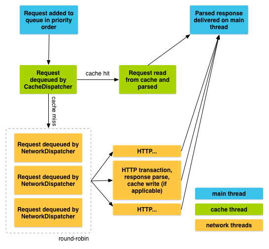
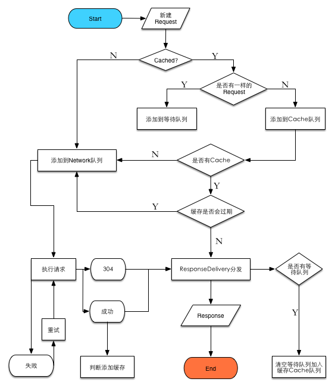

关于Volley框架的基本介绍，可以看下面几篇文章：

1. [Android 网络通信框架Volley简介(Google IO 2013)](http://blog.csdn.net/t12x3456/article/details/9221611)
2. [Volley 源码解析](http://www.codekk.com/open-source-project-analysis/detail/Android/grumoon/Volley%20%E6%BA%90%E7%A0%81%E8%A7%A3%E6%9E%90)
3. [Transmitting Network Data Using Volley](https://developer.android.com/training/volley/index.html)

看完这几篇博客，对 Volley 应该有比较好的了解。下面讨论几个 Volley 做的不错的方面。<!--more-->

## 一、职责切分
### 1.1 纵向切分
即对整个请求流程的切分，包括以下几个部分:

1. RequestQueue 负责请求的执行和取消等操作；
2. Dispatcher 负责分发相应的请求；
3. ResponseDelivery 负责 Response 的分发：在很多网络框架实现中，这部分并不是独立出来的。这个接口定义了三个 API，但是只有一个用到了，这里独立出来会使得整个 Response 的处理更加清晰；

这三个部分涉及到一个请求的生命周期。流程如下：

下面是我自己绘制的一个更加详细的流程图：

### 1.2 横向切分
针对上面三个部分的细致切分，主要体现在第二步，包括：

1. Request 的重试部分独立出来成为了类 RetryPolicy，整个配置一下子灵活起来，具体可以参见：DefaultRetryPolicy（注意这里的接口设计）；
2. 请求发送方式做了拆分（主要是因为 HttpURLConnection 的 Bug）：定义 HttpStack 接口。最终这部分策略被封装在 Network 里面，由 Network 统一完成 Request 的发送执行；
3. 缓存和网络请求的拆分:CacheDispatcher 和 NetworkDispatcher。不过这里有个值得商榷的点：一般 OO 设计来说，这两个 Dispatcher 所操纵的队列肯定是属于 Dispatcher 的一个属性，然后由 Dispatcher 向外暴露操纵队列的接口，这样有利于封装。但是在 Volley 里面，这两个队列直接暴露在 RequestQueue 中，两个Dispatcher 之间的交互也并不是直接引用对方，而是通过直接操作 RequestQueue 来实现；

## 二、Log 调试
Volley 的 Log 机制做的是比较 Nice 的：Volley 自己实现了 Log，并且在 Request 类中新建了 Log 类的实例，Request 的 Log 与 Request 实例绑定，在任何时候，只要 Request 存在，都可以观察一个 Request 完整的 Log，并且通过 Log 确认他的状态与生命周期。与一般简单的 Log 相比，尤其是在多线程情况下，显得更加清楚。

> 后期我在很多项目的开发过程中都使用了这种日志形式，对于调试多线程问题很有帮助。

## 三、细节
1. ByteArrayPool：用于处理请求返回数据时分配 Byte[]，节省资源，相信对整体的性能和稳定性都有较大的提升；  
2. Request 的设计：暴露了两个接口：`deliverResponse` 和`parseNetworkResponse`，这两个接口暴露出来能够让开发者可以定制自己的请求类型（代表有 StringRequest 和 JSONRequest ），同时最后的分发（回调）也可以定制，但是奇怪的是这里有点错乱破碎：正常的请求回调是可以进行分发的，但是请求错误回调则是写死的。如果需要像正常回调一样可以通知到多个监听者，就需要再做一层开发，不爽；  
3. RetryPolicy 作为独立的类设计，使得重试机制变得异常灵活（开发者可以自己实现 RetryPolicy，但是需要注意实现一定要参照 DefaultRetryPolicy，尤其是 retry 方法）。这里的重试实现的比较精巧（但是也难以看懂）：具体的实现可以查看 BasicNetwork 的 performRequest 方法，这里的 while 循环只有在获得正确返回值或者抛出异常的时候才会被打断，否则会不停尝试；  
4. RequestFuture 的实现也很有意思：这个类是实现同步请求的，里面有少许关于多线程的知识；  
5. NoCache：这个类是实现无缓存机制的，为不支持某一种功能提供了一个实现方式（很清晰，很赞）；  

## 四、总结
正如其在 Developer 中描述的一样，Volley 框架有很多优秀的特性。除了上面所描述的一些细节，对 Http 标准协议的实现都做得不错，整个框架非常专注且灵活，看其源码，受益匪浅。

> 2018-10-24 补充：Volley 在功能的设计实现上亮点颇多，这里提到的很多设计点我在项目的开发中都有所借鉴，极大的提高了项目的质量，可以说是到目前为止对我影响最大的一个开源库。