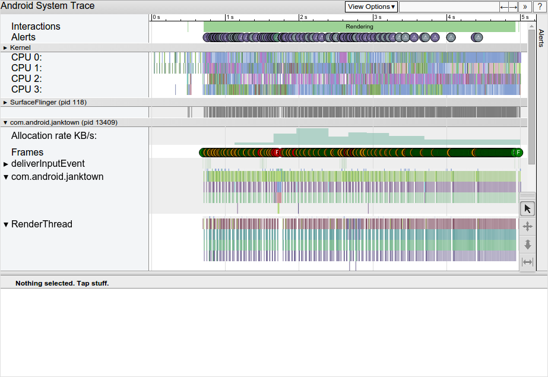
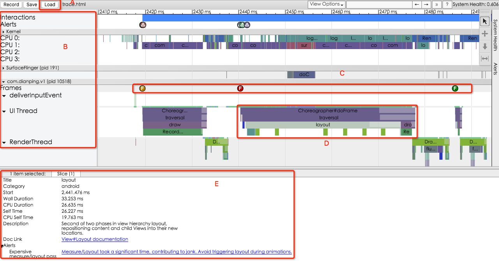
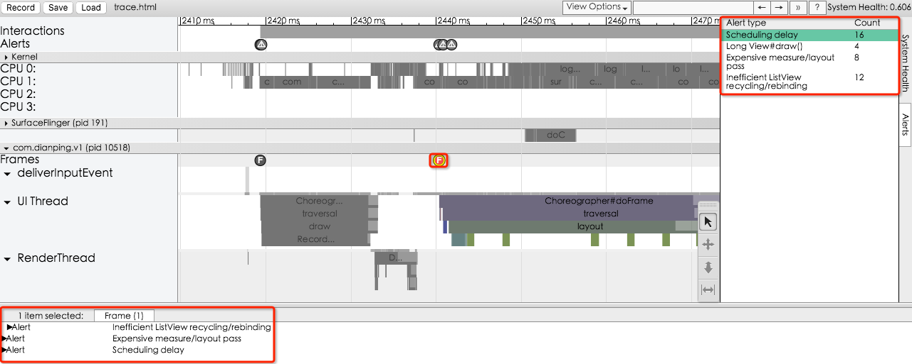

当我们开发应用，我们会希望应用使用起来非常顺畅，刷新页面的时候始终可以达到 60 帧每秒的速度。但是如果因为某些原因导致丢帧，我们要做的第一步事情就是搞清楚系统到底在做什么。

>Systrace 允许获取 Android 系统的信息，称为 __trace__。它会展现时间以及 CPU 时间片被用到了哪里，在给定的时间内，每个进程和线程在做什么事情，它还会高亮有问题的 trace 信息，并给出修复意见。

## Overview


上图展示了一个渲染起来并不顺畅的 App 所被捕捉到的 trace 信息，展示的信息组有 Kernel、SurfaceFlinger（Android的 compositor 进程），然后是 App 进程（可以看到进程名），每一个 App 进程都包含所有它所含有的线程的 trace 信号。

关于如何产生一个 trace 文件，可以直接查看[官网](http://developer.android.com/intl/zh-cn/tools/performance/systrace/index.html)。这里有个[示例文件](http://7xktd8.com1.z0.glb.clouddn.com/trace.html)，可以下载。

## Analyzing a Trace


当产生trace文件之后，就可以使用浏览器打开html文件了。
>实际使用 chrome 直接打开 trace 文件的时候，遇到如下错误: `Could not find an importer for the provided eventData.`。解决方案是:
>
>1. 在 chrome 中打开链接`chrome://tracing`;
>2. 在打开的页面的左上角有一个 Load 按钮(见图中`A`处)，点击选择 trace 文件，打开即可；
>
>另外，看图的时候记住一句话： A well-behaved application executes many small operations quickly and with a regular rhythm, with individual operations completing within few milliseconds, depending on the device and the processes being performed。

每一个渲染帧的 App 都会展现一行 frame 圆圈（见`C`处）——通常是绿色的，如果圆圈是黄色或者红色的，那就表明这一帧超过了 16.6ms 的帧渲染时间限制。放大视图就可以看清楚哪些影响 App 顺滑的帧了（见`D`处）。
>[官网](http://developer.android.com/intl/zh-cn/tools/help/systrace.html)上列出了关于该工具的一些命令行和快捷键。

点击某一个 frame 圆圈，这个圆圈就会被高亮，从而聚焦到绘制这一帧的时候所做的工作上。在运行着 5.0 以及更高版本系统的设备上，工作被分为 UI 线程和 Reader 线程，在之前的版本上，创建帧的所有工作都是在 UI 线程上执行的。

在这一帧上点击不同的部分（即`D`处不同的色块），可以查看它们耗时多少。选中 frame 圆圈或者某一个部分，在`E`处都可以看到相关的有用信息，即 Alert。

### Investigating Alerts
Systrace 会对 trace 中的信息做一些自动分析，然后将存在的性能问题作为 alert 展示出来，从而为解决问题提供指导。

当选中某个存在问题的帧之后，alert 就可能在`E`处展现：如果是 UI 线程负荷太重，就可以使用 [TraceView](http://www.muzileecoding.com/androidoptimize/Android-traceview.html) 来诊断具体是什么导致的问题。

在整个面板的右侧，还有一个 Alert Tab，你可以通过它查看 trace 文件信息中的所有的 Alert 以及它的数量。如下:

下面的红框展现了我所选当前问题帧暴露出来的三个 Alert，而右侧红框则展现了当前 trace 文件中的所有 alert 的统计信息。

>这个非常有用，当操作比较集中时，可以很容易发现问题，配合 TraceView 可以比倨傲容易找出问题所在。官网建议把统计出来的问题当做 Bug 修掉。

## Tracing Application Code
framework 定义的 trace 信号并不能全面展现 app 所做的所有事情，所以你可能需要添加你自己的信号，在Android4.3 以及更高的版本上，开发者可以使用`Trace`类来给代码添加信号，这个技术可以帮助你观察任何时候 App 所做的工作。Trace 开始和结束本身也会造成一定的影响。

下面是一个示例:

```java
public void ProcessPeople() {
    Trace.beginSection("ProcessPeople");
    try {
        Trace.beginSection("Processing Jane");
        try {
            // code for Jane task...
        } finally {
            Trace.endSection(); // ends "Processing Jane"
        }

        Trace.beginSection("Processing John");
        try {
            // code for John task...
        } finally {
            Trace.endSection(); // ends "Processing John"
        }
    } finally {
        Trace.endSection(); // ends "ProcessPeople"
    }
}
```
>要注意: `beginSection()`和`endSection()`要成对出现。而且两个方法要在同一个线程出现。

当使用 App 级别的 trace，就必须要在用户 UI 或者命令行中使用`-a`/`--app=`指定包名。

当 profile app 的时候，最好打打开 app 级别的 trace 功能，这样一些框架将通过 trace 提供一些非常重要的信息，比如`RecyclerView`。