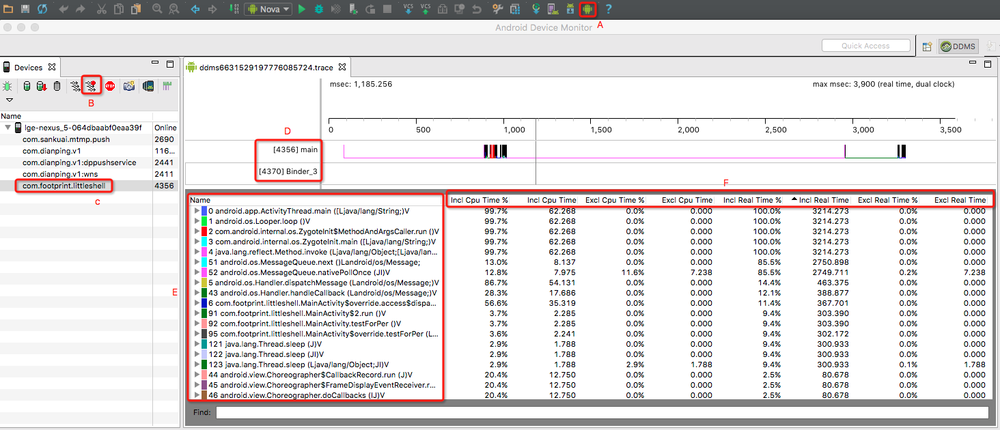

## 前言
[官网介绍](http://developer.android.com/intl/zh-cn/tools/debugging/debugging-tracing.html)

## 操作


如图所示，我们可以按照以下步骤完成数据获取和展示：

1. 点击`A`处的 Android 小人 Icon 打开 TraceView 操作页面；
2. 在`C`处选择需要监控的进程，选择完毕后，`B`处的 Icon 就会亮起；
3. 准备好应用程序，点击`B`处的按钮，操作应用程序，再次点击`B`处的按钮，即可生成 trace 文件；
4. Android Studio 自动在操作页面的右边打开 trace 文件；

执行完毕后就可以见到如图所示的界面。另外，能翻墙的童鞋可以查看[官网指导](http://developer.android.com/intl/zh-cn/tools/performance/traceview/index.html)。

>还有一种办法是通过插入 Debug 代码获取 trace 文件，详细可参考 [Android调试工具之Traceview](http://www.cnblogs.com/devinzhang/archive/2011/12/18/2291592.html)。
>
>在问题没有确定，不知道具体出问题的代码在哪里时，使用这种方法定位比较繁琐。可以使用图形化操作方式大致确定函数（这种方式监控的函数很多，分析起来比较困难），然后再通过代码插入方式进一步分析。

## 分析
从上图打开的 trace 视图来看，主要分为两个部分：

1. 上半部分称为"Timeline Panel"：描述了每一个线程的每一个方法的启动和结束时间；
2. 下半部分称为"Profile Panel"：分析了每一个方法所做的事情以及耗费的时间；

`E`处列出了主线程这段时间执行的所有函数，点击最左边的箭头可以展开，看到该函数是被谁唤起调用的(Parents)，又调用了哪些子函数（Children）。

`F`处则展现了各个统计维度下的值。下面就详细来说说这块。

### 统计维度
Profile Panel 共展现了一个方法的以下统计数据:

| 维度                   | 解释                                           |
| ---------------------- | ---------------------------------------------- |
| Incl Cpu Time          | 函数本身运行占用的 CPU 时间，包括子函数        |
| Excl Cpu Time          | 函数运行占用的 CPU 时间，不包括子函数          |
| Incl Real Time         | 函数本身运行的真实时间，包括子函数             |
| Excl Real Time         | 函数运行的真实时间，不包括子函数               |
| Call+Recur Calls/Total | 函数被调用的总次数以及递归调用占总次数的百分比 |
| Cpu Time/Call          | 函数平均每次调用所用的 CPU 时间                |
| Real Time/Call         | 函数平均每次调用所用的真实时间                 |

>关于 CPU 时间和真实时间之间的区别，可以看 StackOverFlow 上的一个[帖子](http://stackoverflow.com/questions/15760447/what-is-the-meaning-of-incl-cpu-time-excl-cpu-time-incl-real-cpu-time-excl-re): 真实时间其实包括了诸如 I/O 等待时间，线程上下文切换时间等待等。
>
>从数据看，这个推断是成立的，第一个论据就是所有函数的 CPU 时间都小于真实时间。另外一个证据，后面再说。

### 实战
按照这个解释，我们来看一个🌰。我在主线程中调用了一个如下方法:

```java
public void testForPer() {
	try {
		Thread.sleep(300);
		Toast.makeText(MainActivity.this, "Done", Toast.LENGTH_SHORT).show();
	} catch (InterruptedException e) {
		e.printStackTrace();
	}
}
```
很明显，这个写法是有问题的。那么我们怎么找出它呢？根据真实时间和 CPU 时间的差别，很容易确定一点：这个方法虽然真实时间很长，达 300ms+，但是 CPU 时间很短，因为有 300ms 处于睡眠状态。所以要捕捉这样一个方法，应该从真实时间出发。

这个方法执行时间长，是因为调用了 Thread 的`sleep()`方法，这个方法 300ms 才返回，因此应当选择包含子函数的维度，否则该方法没有特殊的地方。

符合以上判断的指标有: Incl Real Time、Real Time/Call。
在上图的`E`处选择到这两个维度，点击Header，使得其中一项是递减排列的。


如图很快就可以抓出这个函数。再看下面这个图，有全部维度的数据：


可以看到 Incl Real Time(303.390ms) 比 Incl CPU Time(2.285) 大约就长了 300ms，正是 sleep 的时间，佐证了前面关于真实时间和 CPU 时间的猜测。

>PS：这个例子中的真实时间和 CPU 时间的差距比较靠谱是因为此时 CPU 时间比较充裕，读者可以考虑一下如果当前有数十个线程会发生什么情况？

## 总结
上面的实战是一个倒推的过程，也就是说我们先知道了问题的所在，再去捕捉它，但实际开发中我们无法得知问题所在，更不能做出如上的判断，那么该如何下手呢？

实际上开发中常见的两类问题函数如下：

1. 调用次数非常频繁的函数——这类函数必须关注效率，并且防止过多的分配内存；
2. 执行时间很长的函数——比如我们的例子中展现的`testForPer()`；

前者我们是可以通过 Call + Recur Calls/Total 维度去看，查找出调用次数非常多的函数，找出这些函数后，如果它们占用的 CPU 时间非常多（可以通过 Incl CPU Time 判断），则需要优化，另外内存这块可能需要手动 check 代码，或者通过别的工具检测。

第二种情况稍微复杂一点，除了例子中展现的这类函数，的的确确是有另外一类函数，自身执行时间非常耗时，比如解析一个超长的文本文件就会导致函数本身耗时很久，这个时候就可以使用 CPU 时间来判断了。
>可以结合前面的问题进行思考。

因为无法判断具体问题所在，所以可能需要从多个维度对函数进行排序，观察是否有函数出现“不正常”情况，并做出相应的处理。

最后这里也有一篇文章写的比较清晰: [正确使用Android性能分析工具——TraceView](http://bxbxbai.github.io/2014/10/25/use-trace-view/)。