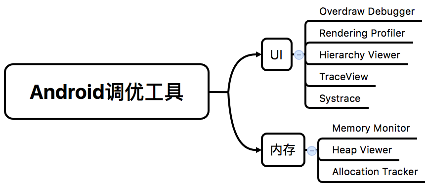

今天在整理 Systrace 的时候看到了一句话：

__After building features, eliminating bugs and cleaning up your code, you should spend some time looking at the performance of your application.__

道出了程序猿从始至终的工作啊。

[官网](http://developer.android.com/intl/zh-cn/tools/performance/index.html)上提供了一些列工具用于辅助提高程序的性能，主要包含以下方面:<!--more-->

1. UI；
2. 内存；
3. 电量；

虽然没有提及流量，但是实际上在 Android Monitor 上已经有所支持，且在 [Android性能优化系列视频](http://www.muzileecoding.com/android/Android-performance.html) 中也提到相关工具，比如 [Network Traffic tool](http://developer.android.com/intl/zh-cn/tools/debugging/ddms.html#network)。

从实际开发的角度，UI 和内存是比较重要的两块，Android 在这两块提供的支持也最多:

1. UI 上的过度绘制，嵌套层次过深，会导致页面的卡顿，进而影响用户体验；
2. 内存使用不合理，诸如内存泄露、抖动等问题会导致程序不稳定；

以下是提供的工具图：

关于流量，遵循一定的策略（比如数据压缩，数据缓存），问题不会很大——重要的是请求的时间。

关于电量，[Android性能优化系列视频](http://www.muzileecoding.com/android/Android-performance.html) 中也有所提及——比如不要采用轮询机制与服务端保持通信，因为网络请求会唤醒无线电通信模块，这是非常耗电的操作，还有通过 WakeLock 唤醒屏幕等操作，也需要慎重。

>当出现卡顿问题，这些工具可以作为一个入口发现问题所在：锁定超时函数。