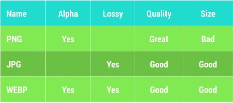
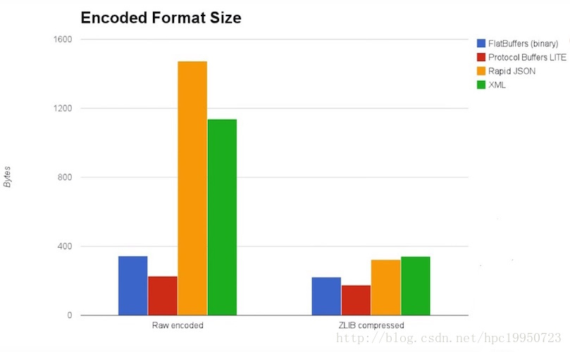
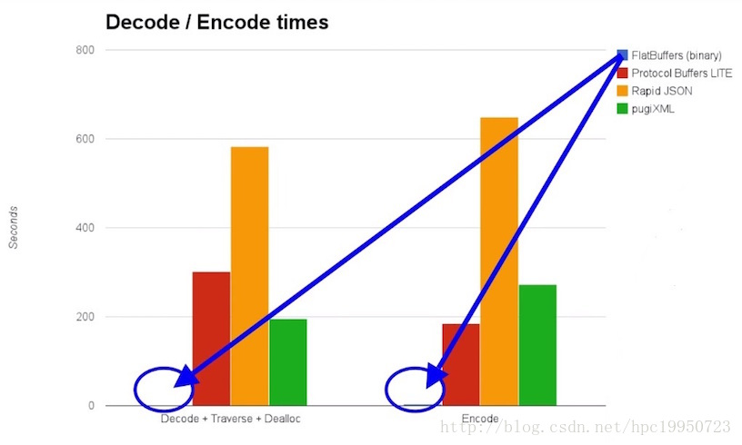

>感谢[@胡凯](http://hukai.me)的辛勤劳动。

### 第一季
##### 1.Render Performance
UI这块直接看[原文](http://www.csdn.net/article/2015-01-20/2823621-android-performance-patterns)。

##### 2.Memory Churn and performance
导致 GC 频繁执行有两个原因：

1. Memory Churn 内存抖动，内存抖动是因为大量的对象被创建又在短时间内马上被释放。
2. 瞬间产生大量的对象会严重占用 Young Generation 的内存区域，当达到阀值，剩余空间不够的时候，也会触发 GC。即使每次分配的对象占用了很少的内存，但是他们叠加在一起会增加 Heap 的压力，从而触发更多其他类型的 GC。这个操作有可能会影响到帧率，并使得用户感知到性能问题。

<!--more-->解决上面的问题有简洁直观方法，如果你在 Memory Monitor 里面查看到短时间发生了多次内存的涨跌，这意味着很有可能发生了内存抖动。可以通过 Heap 和 Allocation Tracker 工具来查看此时内存中分配的到底有哪些对象。
<div align="center"></div>

比如在 for 循环中执行了创建对象的操作。

##### 3.Understanding Battery Drain on Android
从 Android 5.0 开始发布了 Battery History Tool，它可以查看程序被唤醒的频率，由谁唤醒的，持续了多长的时间，这些信息都可以获取到。

要注意 WakeLock 的用法。

### 第二季
>包括的内容大致有：电量优化、网络优化、Android Wear 上如何做优化、使用对象池来提高效率、LRU Cache、Bitmap 的缩放、缓存、重用、PNG 压缩、自定义 View 的性能、提升设置 alpha 之后 View 的渲染性能，以及 Lint、StictMode 等工具的使用技巧。

##### 1.To Index or Iterate?
循环遍历的方式：1）for；2）for...each...；3）Iterator三种的效率不一样，for 效率更高，但是这个和编译器有关，需要实际检验。

##### 2.Hidden Cost of Transparency
alpha 会要求 View 进行 Blend 混色处理，触发了额外的绘制任务，这样会导致不少性能问题。

如何渲染才能够得到我们想要的效果呢？我们可以先按照通常的方式把 View上的元素按照从后到前的方式绘制出来，但是不直接显示到屏幕上，而是使用 GPU 预处理之后，再由 GPU 渲染到屏幕上，GPU 可以对界面上的原始数据直接做旋转，设置透明度等等操作。使用 GPU 进行渲染，虽然第一次操作相比起直接绘制到屏幕上更加耗时，可是一旦原始纹理数据生成之后，接下去的操作就比较省时省力。

如何才能够让 GPU 来渲染某个 View 呢？我们可以通过 setLayerType 的方法来指定 View 应该如何进行渲染，从 SDK 16 开始，我们还可以使用 ViewPropertyAnimator.alpha().withLayer() 来指定。

另外一个例子是__包含阴影区域的 View__，这种类型的 View 并不会出现我们前面提到的问题，因为他们并不存在层叠的关系。为了能够让渲染器知道这种情况，避免为这种 View 占用额外的 GPU 内存空间，我们通过设置 View 的`hasOverlappingRendering()`方法返回 false 来实现。

##### 3.Custom Views and Performance
通常来说，针对自定义 View，我们可能犯下面三个错误：

1. Useless calls to onDraw()：我们知道调用`View.invalidate()`会触发 View 的重绘，有两个原则需要遵守，第 1 个是仅仅在 View 的内容发生改变的时候才去触发`invalidate()`方法，第 2 个是尽量使用 ClipRect 等方法来提高绘制的性能。
2. Useless pixels：减少绘制时不必要的绘制元素，对于那些不可见的元素，我们需要尽量避免重绘。
3. Wasted CPU cycles：对于不在屏幕上的元素，可以使用`Canvas.quickReject`把他们给剔除，避免浪费 CPU 资源。另外尽量使用 GPU 来进行 UI 的渲染，这样能够极大的提高程序的整体表现性能。

总的来说：尽量少绘制，绘制的时候尽量降低成本。

### 第三季
>包括的内容大致有：更高效的 ArrayMap 容器，使用 Android 系统提供的特殊容器来避免自动装箱，避免使用枚举类型，注意 onLowMemory 与 onTrimMemory 的回调，避免内存泄漏，高效的位置更新操作，重复 layout 操作的性能影响，以及使用 Batching，Prefetching 优化网络请求，压缩传输数据等等使用技巧。

##### 1. Fun with ArrayMaps
和 SpareArray 等容器一样，是在空间与时间之间做的一个权衡：它们速度不如 HashMap(采取的是折半查找)，但占用更少的内存。

对象个数也最好比较少，原文说的是千以内：过多的话，由于实现问题，会导致效率下降。

这些容器顺带着也照顾了自动装箱拆箱问题——也会导致一些性能问题，并且会创建出很多的对象。

##### 2.The price of ENUMs
官方原文:
>Enums often require more than twice as much memory as static constants. You should strictly avoid using enums on Android.

枚举会大大增加包体积大小，产生额外的内存消耗，官网强烈建议不要再 Android 程序中使用枚举。

##### 3.Trimming and Sharing Memory
可以参考[Android Training - 管理应用的内存](http://hukai.me/android-training-managing_your_app_memory/)。

从 Android 4.4 开始，ActivityManager 提供了 isLowRamDevice() 的 API，通常指的是 Heap Size 低于 512 M或者屏幕大小 <=800*480 的设备。

##### 4.Location & Battery Drain
凡是请求耗资源的资源，都可以通过历史的数据改变请求间隔，尽量减少请求次数。

定位可以通过`LocationRequest.setPriority()`在耗电量和精确性之间做出权衡。

##### 5.Double Layout Taxation
1. 尽量保持 View Hierarchy 的层级比较浅，这样即使发生重复 layout，也不会因为布局的层级比较深而增大了重复 layout 的负荷；
2. 在任何时候都请避免调用` requestLayout()`的方法，因为一旦调用了`requestLayout`，会导致该 layout 的所有父节点都发生重新 layout 的操作；

##### 6.Network Performance 101
两个原则：

1. 减少移动网络被激活的时间与次数；
2. 压缩传输数据；

产生网络的行为可以划分为三种类型：

1. 用户主动触发的请求；
2. 被动接收服务器的返回数据；
3. 最后一个是数据上报，行为上报，位置更新等等自定义的后台操作；

应该遵循下面的规则来处理数据同步的问题；

1. 在某些必须做同步的场景下，需要避免使用固定的间隔频率来进行更新操作，我们应该在返回的数据无更新的时候，使用双倍的间隔时间来进行下一次同步（策略调整）;
2. 使用 Batching（批处理）的方式来集中发出请求，避免频繁的间隔请求;
3. 使用 Prefetching（预取）的技术提前把一些数据拿到，避免后面频繁再次发起网络请求;
4. 对网络行为进行分类，区分需要立即更新数据的行为和其他可以进行延迟的更新行为，为不同的场景进行差异化处理；
5. 要避免客户端对服务器的轮询操作，这样会浪费很多的电量与带宽流量。解决这个问题，我们可以使用Google Cloud Message 来对更新的数据进行推送；
6. 还可以通过判断当前设备的状态来决定同步的频率，例如判断设备处于休眠，运动等不同的状态设计各自不同时间间隔的同步频率；
7. 可以通过判断设备是否连接上 Wi-Fi，是否正在充电来决定更新的频率。为了能够方便的实现这个功能，Android 为我们提供了 GCMNetworkManager 来判断设备当下的状态，从而设计更加高效的网络同步操作；

##### 7.Effective Network Batching
发起网络请求与接收返回数据都是比较耗电的，在网络硬件模块被激活之后，会继续保持几十秒的电量消耗，直到没有新的网络操作行为之后，才会进入休眠状态。前面一个段落介绍了使用 Batching 的技术来捆绑网络请求，从而达到减少网络请求的频率。那么如何实现 Batching 技术呢？通常来说，我们可以会把那些发出的网络请求，先暂存到一个 PendingQueue 里面，等到条件合适的时候再触发 Queue 里面的网络请求。

可是什么时候才算是条件合适了呢？最简单粗暴的，例如我们可以在 Queue 大小到 10 的时候触发任务，也可以是当手机开始充电，或者是手机连接到 WiFi 等情况下才触发队列中的任务。手动编写代码去实现这些功能会比较复杂繁琐，Google 为了解决这个问题，为我们提供了 GCMNetworkManager 来帮助实现那些功能，仅仅只需要调用 API，设置触发条件，然后就 OK 了。

预取以及网络行为还要考虑当前的网络状态是否良好——根据网络状态调整行为。

Android 官方为了帮助我们设计自己的网络请求策略，提供了模拟器的网络流量控制功能来对实际环境进行模拟测量，或者还可以使用 AT&T 提供的 [AT&T Network Attenuator](http://developer.att.com/developer/legalAgreementPage.jsp?passedItemId=14500040) 来帮助预估网络延迟。

使用 [Network Traffic tool](http://developer.android.com/intl/zh-cn/tools/debugging/ddms.html#network) 可以查看网络请求发生的时间，每次请求的数据量等等信息。

##### 8.Effective Prefetching
预先获取多少数据量是很值得考量的，因为如果预取数据量偏少，就起不到减少频繁请求的作用，可是如果预取数据过多，就会造成资源的浪费。

我们可以参考在 WiFi，4G，3G 等不同的网络下设计不同大小的预取数据量，也可以是按照图片数量或者操作时间来作为阀值。这需要我们需要根据特定的场景，不同的网络情况设计合适的方案。

### 第四季
>涉及的内容有：优化网络请求的行为，优化安装包的资源文件，优化数据传输的效率，性能优化的几大基础原理等等。

##### 1.Cachematters for networking
Android 系统上关于网络请求的 Http Response Cache 是默认关闭的，这样会导致每次即使请求的数据内容是一样的也会需要重复被调用执行，效率低下。我们可以通过下面的代码示例开启 HttpResponseCache。

开启 Http Response Cache 之后，Http 操作相关的返回数据就会缓存到文件系统上，不仅仅是主程序自己编写的网络请求相关的数据会被缓存，另外引入的 library 库中的网络相关的请求数据也会被缓存到这个 Cache 中。

Http 自己有缓存机制，但是有可能失效（不是每一个服务端都会返回正常的缓存 Header），因此有时候我们需要自己管理缓存，开源框架这个时候就比较有用了。

可以使用 Android Studio 里面的 Network Traffic Tools 来查看网络数据的请求与返回情况，另外我们还可以使用 [AT&T ARO工具 ](https://developer.att.com/application-resource-optimizer)来抓取网络数据包进行分析查看。

##### 2.Optimizing Network Request Frequencies
这部分集中到第三季有关网络的部分。

##### 3.Minimizing Asset Payload
主要是图片个序列化数据。

图片可以从格式入手:
<div align="center"></div>

>Webp，它是由Google推出的一种既保留png格式的优点，又能够减少图片大小的一种新型图片格式。关于Webp的更多细节

尽量减少 PNG 图片的大小是 Android 里面很重要的一条规范。相比起 JPEG，PNG 能够提供更加清晰无损的图片，但是 PNG 格式的图片会更大，占用更多的磁盘空间。到底是使用 PNG 还是 JPEG，需要设计师仔细衡量，对于那些使用 JPEG 就可以达到视觉效果的，可以考虑采用 JPEG 即可。我们可以通过 Google 搜索到很多关于 PNG压缩的工具。

另外：服务器应该支持到为不同的使用场景分别准备多套清晰度不一样的图片，以便在对应的场景下能够获取到最适合自己的图片。

>了解 Bitmap 的4种解码格式，inBitmap 属性。

Google 介绍了一个开源的加载 bitmap 的库：__Glide__，这里面包含了各种对 bitmap 的优化技巧。

数据可以从序列化方式入手，应该使用 Protocal Buffers，Nano-Proto-Buffers，FlatBuffer 来减小序列化的数据的大小。

1. __【Protocal Buffers】__强大，灵活，但是对内存的消耗会比较大，并不是移动终端上的最佳选择。
2. __【Nano-Proto-Buffers】__基于 Protocal，为移动终端做了特殊的优化，代码执行效率更高，内存使用效率更佳。
3. __【FlatBuffers】__这个开源库最开始是由 Google 研发的，专注于提供更优秀的性能。

对比数据如下:
<div align="center"></div>

<div align="center"></div>

另外：__数据呈现的顺序以及结构会对序列化之后的空间产生不小的影响（这一点建议看原文，很重要！）。__

##### 4.APK瘦身
```java
buildTypes{
	release{
		minifyEnabled true //删除无用的代码
		shrinkResource true //删除无用的资源
	}
}
```
可以通过 tools:keep 或者是 tools:discard 标签来实现对特定资源的保留与废弃——和 Proguard 的 keep 一样。

### 第五季
>涉及的内容有：多线程并发的性能问题，介绍了 AsyncTask、HandlerThread、IntentService 与 ThreadPool 分别适合的使用场景以及各自的使用注意事项。
><div align="center"></div>

从 Android M 系统开始，系统更新了 GPU Profiling 的工具来帮助我们定位 UI 的渲染性能问题。早期的 CPU Profiling 工具只能粗略的显示出 Process、Execute、Update 三大步骤的时间耗费情况。

但是仅仅显示三大步骤的时间耗费情况，还是不太能够清晰帮助我们定位具体的程序代码问题，所以在 Android M版本开始，GPU Profiling 工具把渲染操作拆解成如下8个详细的步骤进行显示。

<div align="center"></div>
旧版本中提到的Process、Execute、Update还是继续得到了保留，他们的对应关系如下：
<div align="center"></div>
其他5个步骤分别代表了什么含义：

1. __【Sync & Upload】__通常表示的是准备当前界面上有待绘制的图片所耗费的时间，为了减少该段区域的执行时间，我们可以减少屏幕上的图片数量或者是缩小图片本身的大小。
2. __【Measure & Layout】__这里表示的是布局的onMeasure与onLayout所花费的时间，一旦时间过长，就需要仔细检查自己的布局是不是存在严重的性能问题。
3. __【Animation】__表示的是计算执行动画所需要花费的时间，包含的动画有ObjectAnimator，ViewPropertyAnimator，Transition等等。一旦这里的执行时间过长，就需要检查是不是使用了非官方的动画工具或者是检查动画执行的过程中是不是触发了读写操作等等。
4. __【Input Handling】__表示的是系统处理输入事件所耗费的时间，粗略等于对于的事件处理方法所执行的时间。一旦执行时间过长，意味着在处理用户的输入事件的地方执行了复杂的操作。
5. __【Misc/Vsync Delay】__如果稍加注意，我们可以在开发应用的Log日志里面看到这样一行提示：I/Choreographer(691): Skipped XXX frames! The application may be doing too much work on its main thread。这意味着我们在主线程执行了太多的任务，导致UI渲染跟不上vSync的信号而出现掉帧的情况。

其余都是有关线程的，不作整理。