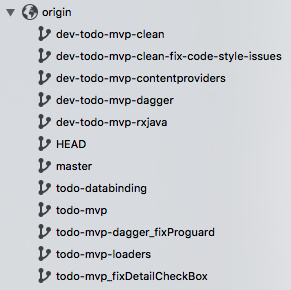
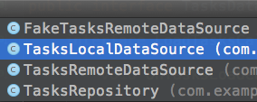

>__设计__, 即根据问题当前的情况以及未来可预见的变化，提供优雅的解决方案。何谓优雅，不是投机取巧，而是兼顾简单易懂、开发成本和灵活易变三者。

前段时间Google官方推出了 __["Android Architecture Blueprints"](https://github.com/googlesamples/android-architecture)__ 项目。正如项目介绍中所说，虽然 Android 平台对于如何组织项目结构提供了很大的自由度，但这种自由度也造成了混乱，使得项目的测试、维护以及扩展遇到困难。

在这个项目里面，Google 针对同一个应用使用不同的架构和技术进行实现，以帮助开发者解决问题。它的重点在于__代码结构，项目架构，测试以及可维护性__。研究这个项目要注意以下几件事情：

1. 架构以及架构的实现由很多种选择，取决于你的现实情况，因此这些例子只是一个指引，并不能作为规范；
2. 这个项目还处于 beta 状态，后期可能会出现影响所有例子的改动；<!--more-->

## 项目目前状态
第一期已经完成近二分之一了：

1. __todo-mvp/__ 基础项目，使用MVP架构；
2. __todo-mvp-loaders/__ 基于mvp项目，但是是使用 Loaders 加载数据；
3. __todo-mvp-databinding/__ 基于 mvp 项目，使用 Data Binding 库实现；

剩余的还有几种技术的组合，目前还在开发中。

## 准备
直接 clone 项目即可，分支如下：
<div align="center"></div>
从分支命名可以看出目前该项目所做的一些工作以及所使用的技术。

## MVP
todo-mvp 是所有例子的基础，它没有依赖任何的其余框架实现了 MVP 架构。这里重点分析`origin/todo-mvp`分支代码。

### 项目结构
<div align="center"></div>

如图所示，除了源码文件夹，还有四个文件夹是专门为测试建立的，关于测试这里不分析，但会阐述一下 MVP 结构对于测试的支持。

<div align="center"></div>

在这里可以看到项目的分包特点：__整体分包是按照页面功能分的，从外部并不能显示的看出是 MVP 模式__。

我们展开详细看一下：
<div align="center"></div>

`A`处是添加 Task 的页面，这里面有四个类，可以清晰的看到 P 的存在，每个类具体的含义下一节细说，`B`从包名以及类名可以推测出是数据源，也就是 Model。`C`处定义了基本的 V 和 P 的接口。

>这个项目的UI都是由 Activity + Fragment 组成的，Activity 和 Fragment 扮演的角色并不一样。

### 项目细说——职责和组装
首先我们先看一下 V 和 P 的基本接口定义，如下:

```java
public interface BasePresenter {
    void start();
}

public interface BaseView<T> {
    void setPresenter(T presenter);
}

```
很简单，P里面只有一个`start()`方法，表示初始加载数据。V 中也只有一个方法`setPresenter()`，用于给 V 设置对应的 P。

接着我们看 A 中圈出的四个类（这四个类对应实现了一个界面，这里拉出来作为例子，其余的界面实现也是一致的），这几个类的关系如下：

1. __`AddEditTaskContract`__ 扩展 BaseView 和 BasePresenter 接口，定义该页面 V 和 P 需要实现的接口；
2. __`AddEditTaskFragment`__ V 接口的实现；
3. __`AddEditTaskPresenter`__ P 接口的实现；
4. __`AddEditTaskActivity`__ M、V、P 三者的组装；

`AddEditTaskActivity`的实现如下：

```java
@Override
protected void onCreate(Bundle savedInstanceState) {
	super.onCreate(savedInstanceState);
	setContentView(R.layout.addtask_act);

	// Set up the toolbar.
	Toolbar toolbar = (Toolbar) findViewById(R.id.toolbar);
	setSupportActionBar(toolbar);
	ActionBar actionBar = getSupportActionBar();
	actionBar.setDisplayHomeAsUpEnabled(true);
	actionBar.setDisplayShowHomeEnabled(true);

	// 创建View
	AddEditTaskFragment addEditTaskFragment = (AddEditTaskFragment) getSupportFragmentManager().findFragmentById(R.id.contentFrame);

	String taskId = null;
	if (addEditTaskFragment == null) {
		addEditTaskFragment = AddEditTaskFragment.newInstance();

	if (getIntent().hasExtra(AddEditTaskFragment.ARGUMENT_EDIT_TASK_ID)) {
		taskId = getIntent().getStringExtra(AddEditTaskFragment.ARGUMENT_EDIT_TASK_ID);
		actionBar.setTitle(R.string.edit_task);
		Bundle bundle = new Bundle();
		bundle.putString(AddEditTaskFragment.ARGUMENT_EDIT_TASK_ID, taskId);
			addEditTaskFragment.setArguments(bundle);
		} else {
			actionBar.setTitle(R.string.add_task);
		}

		ActivityUtils.addFragmentToActivity(getSupportFragmentManager(), addEditTaskFragment, R.id.contentFrame);
	}

	// 创建 Presenter 并将 View 传递给 Presenter
	new AddEditTaskPresenter(taskId, 
	// 创建M
	Injection.provideTasksRepository(getApplicationContext()), addEditTaskFragment);
}
```
如注释所描述，Activity创建了 V、P、M，并将 M、V 传递给了 P，`AddEditTaskPresenter`的构造函数如下：

```java
public AddEditTaskPresenter(@Nullable String taskId, @NonNull TasksDataSource tasksRepository, @NonNull AddEditTaskContract.View addTaskView) {
	mTaskId = taskId;
	//获取到M
	mTasksRepository = checkNotNull(tasksRepository);
	mAddTaskView = checkNotNull(addTaskView);
	//组装 M 和 P
	mAddTaskView.setPresenter(this);
}
```
最后一行，P 将自己设置为 V 的 Presenter。即 Activity 的`onCreate()`方法执行完毕后，M、V、P 三个部分组装完毕。__除了组装，Activity 还负责一件很重要的事情：初始化数据环境__。从`onCreate()`方法可以看到，Activity 获取了对应的 taskId，并传递给了`AddEditTaskFragment`和`AddEditTaskPresenter`两者，这样在编辑一个 Task 的时候，Presenter 才知道具体的编辑对象。
>这里 taskId 应该传入到`AddEditTaskFragment`中么？从实现上看，这个 taskId 在`AddEditTaskFragment`用于判断是在编辑一个 Task 还是在创建一个 Task，这个逻辑应该放在 P 层更加合适。

__组装完毕之后，整个页面是在哪里启动的呢？在 V 中，由 V 的生命周期触发。__`AddEditTaskFragment`的`onResume()`方法实现如下:

```java
@Override
public void onResume() {
	super.onResume();
	mPresenter.start();
}
```
在这个方法里面触发了 mPresenter 的`start()`方法加载数据（正因为Activity初始化了数据环境，因此`start()`函数不需要任何的参数）。

`start()`方法会加载数据，我们来看逻辑：

```java
public void start() {
	openTask();
}

private void openTask() {
	if (null == mTaskId || mTaskId.isEmpty()) {
		mTaskDetailView.showMissingTask();
		return;
	}

	mTaskDetailView.setLoadingIndicator(true);
	mTasksRepository.getTask(mTaskId, new TasksDataSource.GetTaskCallback() {
		@Override
		public void onTaskLoaded(Task task) {
			// The view may not be able to handle UI updates anymore
			if (!mTaskDetailView.isActive()) {
				return;
			}
			mTaskDetailView.setLoadingIndicator(false);
			if (null == task) {
				mTaskDetailView.showMissingTask();
			} else {
				showTask(task);
			}
		}

		@Override
		public void onDataNotAvailable() {
			// The view may not be able to handle UI updates anymore
			if (!mTaskDetailView.isActive()) {
				return;
			}
			mTaskDetailView.showMissingTask();
		}
	});
}
```
这个方法是用于打开一个 Task，它是通过`mTasksRepository`来加载数据的。`TasksRepository`是一个很重要的类，它实现了`TasksDataSource`接口：这个接口中定义了很多的有关 Task 操作的方法，有增删改查等。`TasksRepository`是`TasksDataSource`的一个实现，其余实现类如下：
<div align="center"></div>

这四个实现的关系如下：

1. `TasksLocalDataSource`和`TasksRemoteDataSource`分别通过`TasksDataSource`定义的 API 实现了 Task 的本地（数据库）保存和远端保存（代码里面是一段假实现，Mock 了一下从服务器上操作Task资源的过程）；
2. `TasksRepository`通过以上两个类实现了`TasksDataSource`：把相关的请求直接代理给以上两个类；
3. `FakeTasksRemoteDataSource`则是一个完全的 Mock 类，用于给自动化测试提供数据源；

关于第2点，可以看`TasksRepository`中的一个方法：

```java
@Override
public void saveTask(@NonNull Task task) {
	checkNotNull(task);
	mTasksRemoteDataSource.saveTask(task);
	mTasksLocalDataSource.saveTask(task);

	// Do in memory cache update to keep the app UI up to date
	if (mCachedTasks == null) {
		mCachedTasks = new LinkedHashMap<>();
	}
	mCachedTasks.put(task.getId(), task);
}
```
__在这个 MVP 的实现中，M 对上是暴露出接口的（即`TasksDataSource`），并且整个 App 的数据接口都定义在一个接口中，这样在进行测试的时候便于提供 Fake 数据源。M 层加载完数据之后是通过回调来告诉 P 层的，在`TasksDataSource`中我们可以看到两个回调接口的定义:__

```java
interface LoadTasksCallback {
	void onTasksLoaded(List<Task> tasks);
	void onDataNotAvailable();
}

interface GetTaskCallback {
	void onTaskLoaded(Task task);
	void onDataNotAvailable();
}
```
>PS: `TasksRepository`是单例设计。

以上，我们知道了最基本的 MVP 的实现中各个类的大体作用、位置以及它们的关系。

## MVP-Loader
这个分支演示的是如何通过 Loader 实现 MVP 架构。前面介绍的基本结构以及各个类的职责都没有变化。Loader 主要是用于数据异步加载的，因此在 Model 这块变化比较大。
>关于 Loader 如果有疑问，可以阅读文章：[Loader & LoaderManager](http://www.muzileecoding.com/androidsource/Android-loader-and-loadermanager.html)。

下面我们来看变化。首先在组装上不太一样：

```java
// Create the loader and presenter
TaskLoader taskLoader = new TaskLoader(taskId, getApplicationContext());
new AddEditTaskPresenter(taskId, Injection.provideTasksRepository(getApplicationContext()), addEditTaskFragment, taskLoader, getSupportLoaderManager());
```
这里在创建P的时候，还创建了 Loader 并将它传入给了P，P 怎么使用这个 Loader 呢？

```java
public class AddEditTaskPresenter implements AddEditTaskContract.Presenter,
        LoaderManager.LoaderCallbacks<Task> {
	@Override
	public void start() {
		mLoaderManager.initLoader(TASK_QUERY, null, this);
	}
}
```
P的`start()`方法直接代理给了Loader，并且P自身实现了LoaderCallbacks回调。

在整个App里面总共实现了两个Loader，一个用于加载单个Task，一个用于加载所有的Task。前面提到过原始的MVP实现中`TasksDataSource`有两个回调接口来告诉P层数据加载完毕，这两个接口在这种实现中已经被Loader代替掉。

这种实现的另外一个有意思的地方是：`TasksRepository`里面可以设置观察者，而每一个Loader都实现了接口，成为相应的观察者：

```java
public interface TasksRepositoryObserver {
	void onTasksChanged();
}

public class TasksLoader extends AsyncTaskLoader<List<Task>>
        implements TasksRepository.TasksRepositoryObserver{
	//...
}
```
这是利用了Loader的特性：Loader在监听到数据变化之后，可以通过`forceLoad()`方法重新加载数据并回调通知上层，如下：

```java
@Override
public void onTasksChanged() {
	if (isStarted()) {
		forceLoad();
	}
}
```
这种组合看上去也非常棒，整个结构流转如下：
<div align="center"></div>

因为`TasksRepository`是单例的，页面只要通过Loader从数据源中加载数据，就等于是在数据源中设置了一个监听：因此这种设计可以监听所有数据的变化。

### TODO：继续分析其余实现方式