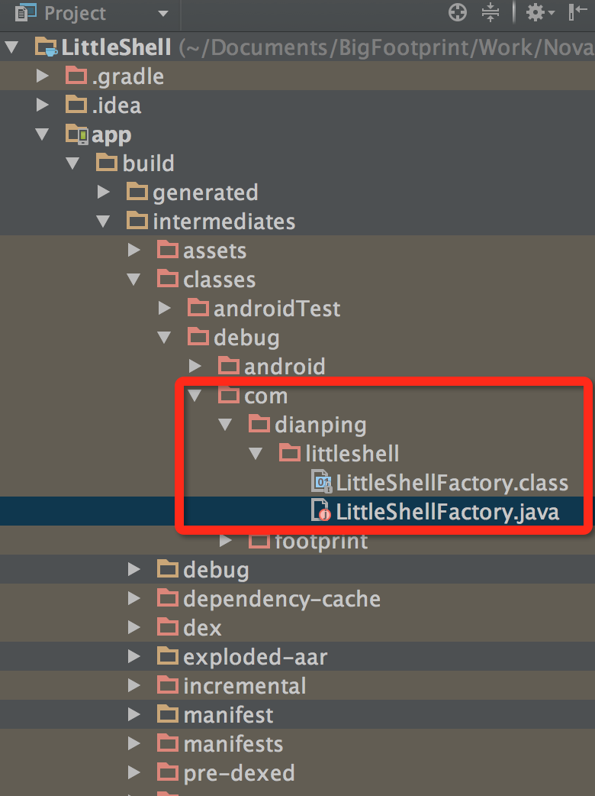

## 前言
注解的基本知识概念略去不表，读者应该知道：

1. 四个元注解： @Retention @Target @Document @Inherited；
2. 对最常用的注解解析方式有所了解；

Retention 表示注解留存的阶段，有三个值：SOURCE，CLASS，RUNTIME。最常见的是 RUNTIME，这类注解可以通过反射的方式进行解析。但是我们今天要说的是 SOURCE 和 CLASS 注解的解析。<!--more-->

## APT
APT，即 Annotation Processing Tool，是 Sun 公司专门开发用来处理注解的。和 javac 一样，apt 直接对 Java 源文件进行处理。apt 工作的时候需要使用一个 AnnotationProcessorFactory 来处理它所遇到的 Annotation ，即 APT 需要为每一个它所遇到的注解找到对应的注解处理器。

注意，在使用 apt 处理注解的时候，不能使用反射，因为你是在处理源代码而不是编译之后的类。Mirror 类补足了这一点。

在《Thinking In Java》中，作者在 __Annotations__ 这一章最后展示了一个ExtractInterface 编译时注解案例，案例很简单读者可以自行阅读并 Coding，这里总结一下主要组成部分：

1. 定义注解；
2. 定义一个类，使用注解；
3. 实现 AnnotationProcessor 接口，该接口有一个 process 方法，处理注解的过程都在这里（最重要的就是写 .java 文件创建新类）；
4. 最重要的是实现 AnnotationProcessorFactory 接口，在这个接口中会建立注解和注解处理器的对应关系；
5. 执行 apt 命令，告诉 apt 使用哪一个 Factory，解析哪一个源码的注解；

下面给一下AnnotationProcessorFactory的代码：

```java
public class InterfaceExtractorProcessorFactory implements AnnotationProcessorFactory {
      public AnnotationProcessor getProcessorFor(
			Set<AnnotationTypeDeclaration> atds,
			AnnotationProcessorEnvironment env) {
			return new InterfaceExtractorProcessor(env);
      }
      public Collection<String> supportedAnnotationTypes() {
			return Collections.singleton("annotations.ExtractInterface");
      }
      public Collection<String> supportedOptions() {
			return Collections.emptySet();
      }
} 
```
命令大致如下：
apt -factory annotations.InterfaceExtractorProcessorFactory Multiplier.java -s ../annotations

PS：在我 Mac 上死活运行不出来，报找不到 InterfaceExtractorProcessorFactory 错误，在网上搜了一圈都没有找到解决方案。不过看很多的 blog，有很多《Thinking In Java》读者都应该运行成功。

## 编译时注解框架
有很多的框架都是编译时注解的，我们在使用的过程中并没有去执行 apt 命令，那么这些框架是怎么实现运作的呢？

[这里](http://www.cnblogs.com/avenwu/p/4173899.html)有一个很好的案例，作者给出了源码，读者可以下载运行。我在 Android 项目中运行这个案例是成功的。（PS：[这篇文章](http://blog.csdn.net/lmj623565791/article/details/43452969)是一个补充）。

重点在于目录结构中的 resources 目录。

我将案例中的注解处理类改造如下：

```java
@SupportedAnnotationTypes({"com.avenwu.annotation.PrintMe"})
public class MyProcessor extends AbstractProcessor {
    private static final String SUFFIX = "Factory";
    private String qualifiedClassName = "com.dianping.littleshell";

    public boolean process(Set<? extends TypeElement> annotations, RoundEnvironment env) {
        Messager messager = processingEnv.getMessager();
        for (TypeElement te : annotations) {
            for (Element e : env.getElementsAnnotatedWith(te)) {
                messager.printMessage(Diagnostic.Kind.NOTE, "Printing: " + e.toString());

                try {
                    JavaFileObject f = processingEnv.getFiler().
                            createSourceFile(qualifiedClassName + ".LittleShell" + SUFFIX);
                    processingEnv.getMessager().printMessage(Diagnostic.Kind.NOTE,
                            "Creating " + f.toUri());
                    Writer w = f.openWriter();
                    try {
                        PrintWriter pw = new PrintWriter(w);
                        pw.println("package " + qualifiedClassName + ";");
                        pw.println("public class LittleShellFactory{");
                        pw.println("    public void print() {");
                        pw.println("        System.out.println(\"Hello boss!\");");
                        pw.println("    }");
                        pw.println("}");
                        pw.flush();
                    } finally {
                        w.close();
                    }
                } catch (IOException x) {
                    processingEnv.getMessager().printMessage(Diagnostic.Kind.ERROR,
                            x.toString());
                }
            }
        }
        return true;
    }

    @Override
    public SourceVersion getSupportedSourceVersion() {
        return SourceVersion.latestSupported();
    }
}
```
然后打包放入Android项目中运行，编译之后发现：



在编译之后的确生成了一个.java类，并且已经编译。那么这个类如何使用呢？或者能否在实际运行环境下获取呢？我尝试了一把：

```java
package com.footprint.littleshell;

import android.os.Bundle;
import android.os.Handler;
import android.support.v7.app.AppCompatActivity;
import android.widget.Toast;

import com.avenwu.annotation.PrintMe;

import java.lang.reflect.InvocationTargetException;
import java.lang.reflect.Method;

public class MainActivity extends AppCompatActivity {

    @Override
    protected void onCreate(Bundle savedInstanceState) {
        super.onCreate(savedInstanceState);
        setContentView(R.layout.activity_main);

        new Handler().postDelayed(new Runnable() {
            @Override
            public void run() {
                Toast.makeText(MainActivity.this, test(), Toast.LENGTH_LONG).show();
            }
        }, 2000);
    }

    @PrintMe
    public String test(){
        try {
            Class cls = Class.forName("com.dianping.littleshell.LittleShellFactory");
            if(cls != null) {
                Method method = cls.getMethod("print");
                method.invoke(cls.newInstance());
                return "AAAAAAAA";
            }

            return "BBBBBBBBB";
        } catch (ClassNotFoundException e) {
            e.printStackTrace();
            return "CCCCCCCCC";
        } catch (NoSuchMethodException e) {
            e.printStackTrace();
            return "DDDDDDDDD";
        } catch (InvocationTargetException e) {
            e.printStackTrace();
            return "EEEEEEEEE";
        } catch (InstantiationException e) {
            e.printStackTrace();
            return "FFFFFFFFF";
        } catch (IllegalAccessException e) {
            e.printStackTrace();
            return "GGGGGGGGG";
        }
    }
}
```
运行结果如下：控制台的确打印出了"Hello boss!"，Toast 显示的是 "AAAAAAAA"，即通过反射可以获取该类，也就证明了注解产生的类最终被打包到了 apk 中。

试验中还发现：包名是任意的，如上，一开始我使用的是 com.footprint.littltshell，后面改成com.dianping.littleshell，两者都没有问题。

## 总结
最后推荐一篇好文：[ANNOTATION PROCESSING 101](http://hannesdorfmann.com/annotation-processing/annotationprocessing101/)，作者写的非常详细，并且有一个完整的例子，读者有兴趣可以研究一下。

>PS：博客讲述了 TypeMirrors 的用法和 JavaWriter 工具，并且提及了 Butter Knife 这个注解开源框架，项目使用 Maven管理，整体结构都很不错，值得读者学习。
